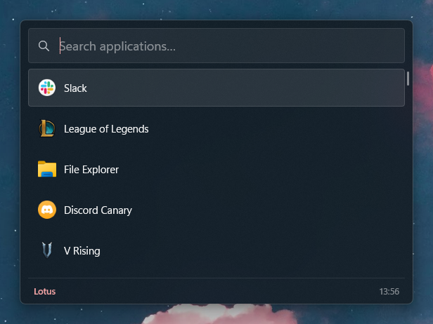

  

# lotus

task bar / windows search / alt tab replacement

## install

download the latest windows zip from releases, extract it, and run `lotus.exe`.

## uninstall

turn off run on startup in settings, close lotus, and delete its folder.
